# MediSense – AI Healthcare App

## Overview

MediSense is an AI-powered healthcare application that provides early disease prediction, diabetes risk analysis, and mental stress detection using machine learning models. It delivers instant results along with personalized precautions, diet plans, and wellness recommendations.

---

## Features

* Disease prediction from symptoms
* Diabetes risk analysis
* Mental stress detection
* Medicine identification system
* AI healthcare chatbot
* Personalized diet, precautions, and workout suggestions

---

## Tech Stack

* Frontend: FlutterFlow
* Backend: FastAPI
* Machine Learning: TensorFlow Lite, Scikit-learn
* Database: Firebase
* API Tunneling: ngrok

---

## APK Download

* Download the latest APK from the **Releases** section of this repository
* Install it on your Android device

---

## Screenshots

## Screenshots

### Home & Navigation

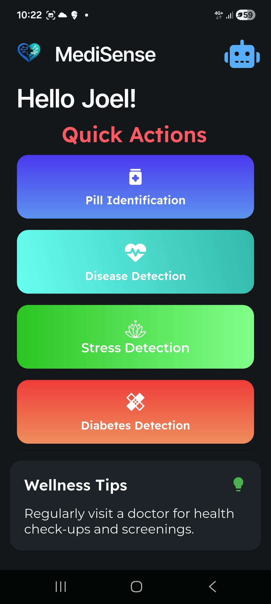
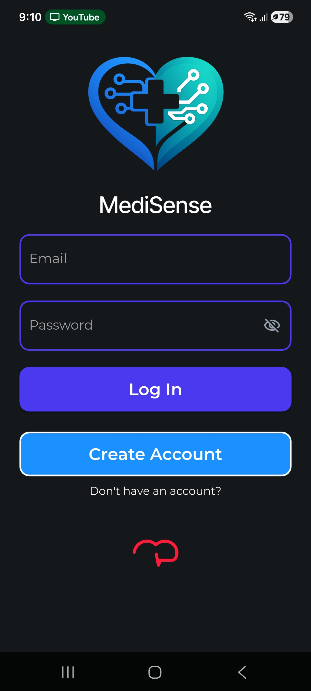
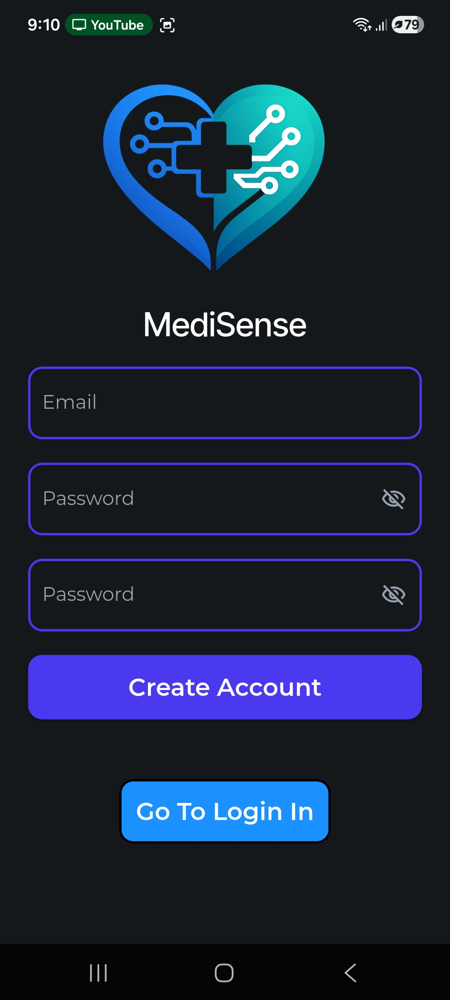
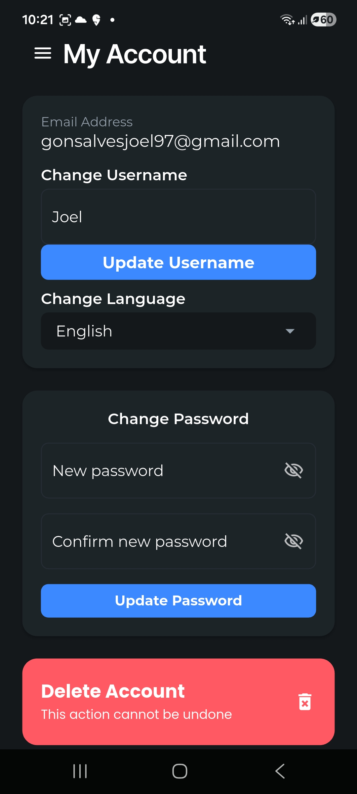

### Core Features

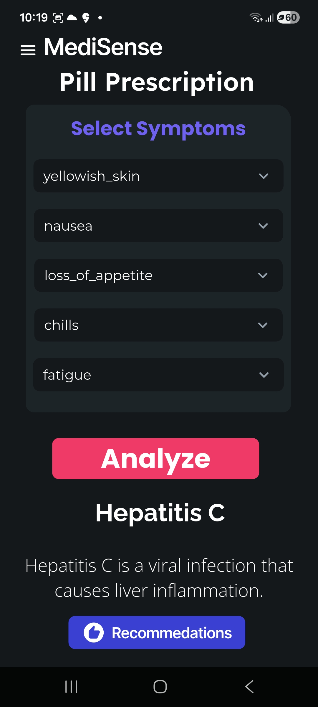
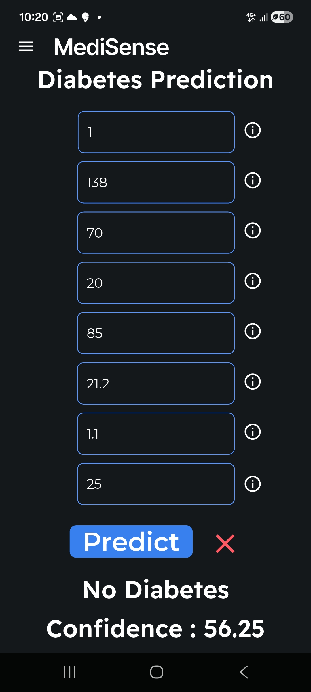
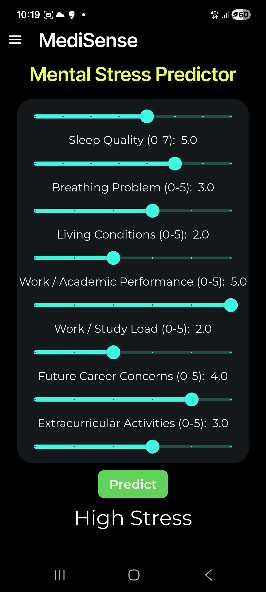

### Additional Features

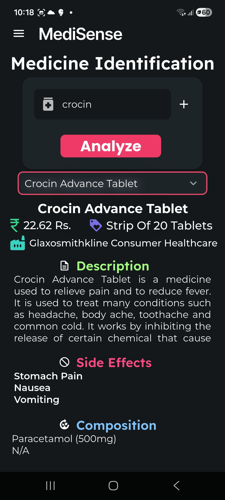
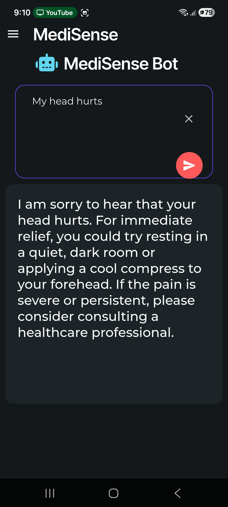
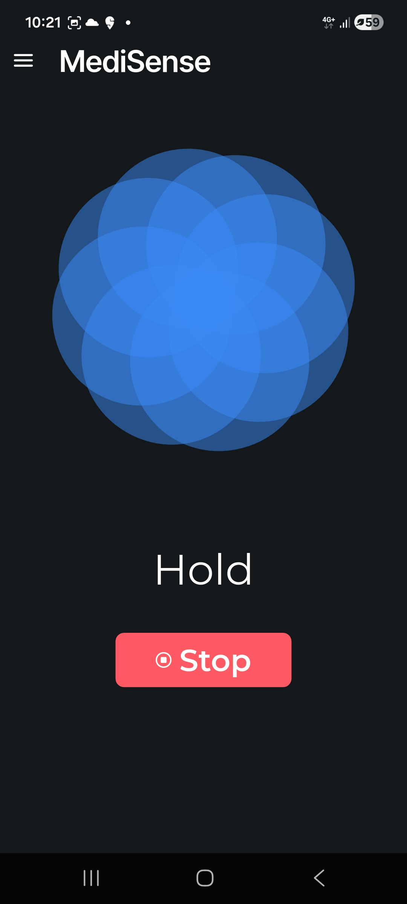

### Results & Feedback

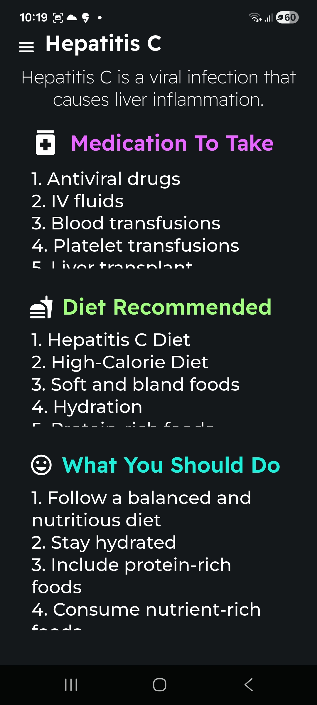
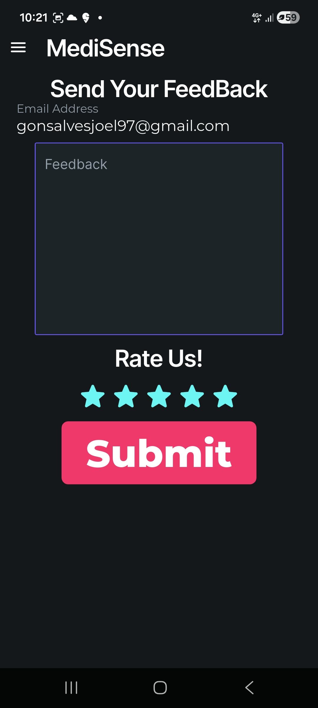

### Admin Panel

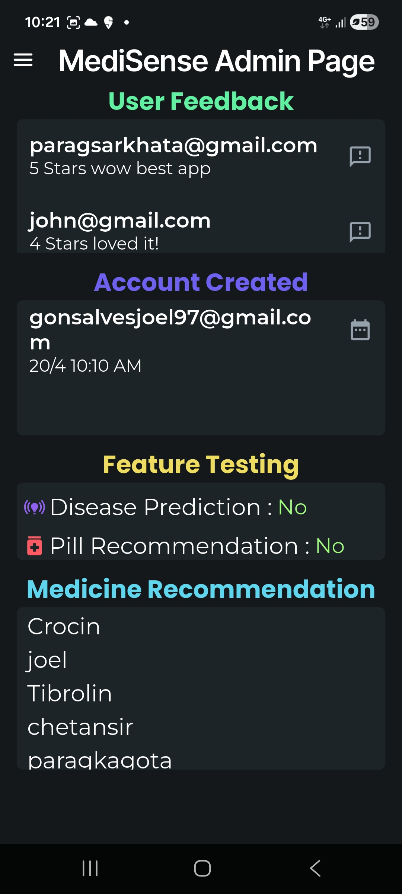

---

## Backend Setup (FastAPI)

### 1. Install Requirements

pip install -r requirements.txt

---

### 2. Run FastAPI Server

uvicorn main:app --reload

* Server runs on:
  http://127.0.0.1:8000

---

### 3. Start ngrok

ngrok http 8000

* Example URL:
  https://abcd1234.ngrok.io

---

### 4. Connect to App

* Replace API base URL in your FlutterFlow project with the ngrok URL

---

### 5. Test API

* Open in browser:
  https://abcd1234.ngrok.io/docs

---

## Project Structure

* main.py → FastAPI entry point
* models/ → ML models (.tflite, .h5)
* data/ → datasets (symptoms, diet, precautions)
* services/ → prediction logic
* screenshots/ → app UI images

---

## How It Works

1. User enters symptoms or health data
2. Backend processes input using ML models
3. API returns predictions and recommendations
4. App displays results in a user-friendly interface

---

## Important Notes

* ngrok URL changes every session
* Update URL in app before testing
* Keep backend running while using the app

---

## Future Improvements

* Real-time doctor consultation
* Wearable device integration
* Cloud deployment (AWS/GCP)
* Advanced health analytics dashboard

---

## Contributors

* Joel Gonsalves
* Parag Sarkhot
* Aksh Soni

---

## License

This project is for educational purposes.
